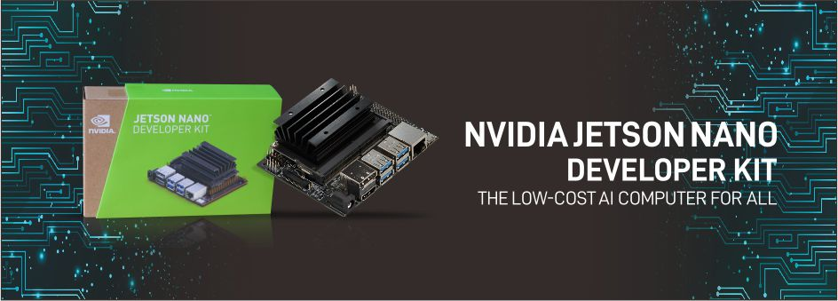

# HappyPet AI

  

PetBowl AI Computer Vision  Nvidia Jetson Nano 

## Motivation

A few months ago my girlfriend adopted a cat named TOM. I currently have a remote job, I spend the day in an office in the apartment, sometimes the cat would come towards me and start meowing, well it was because his food bowl was empty.
I was also thinking about what project to do to obtain the Nvidia certification, two other worlds joined and it occurred to me to train a computer vision algorithm which would detect when Tom's bowl was empty, So he is a happy cat without hunger.

# Project Overview

