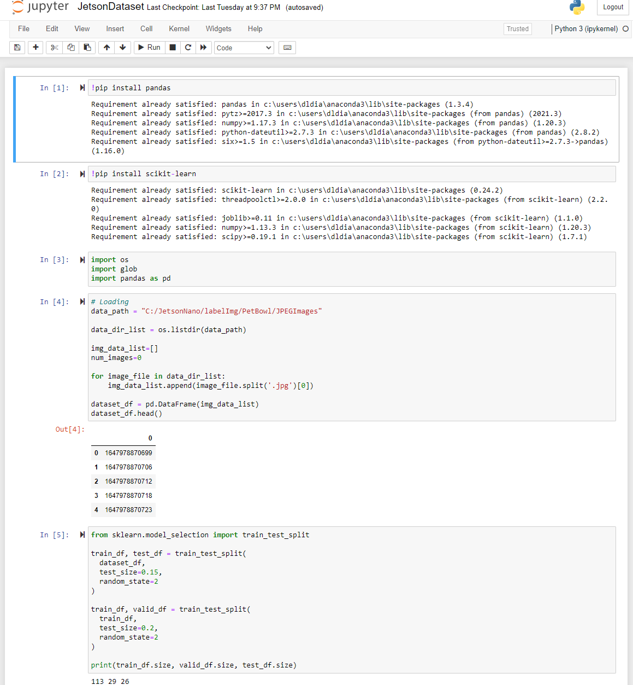

# HappyPet AI
<div align="center">
  
</div>

<div align="center">PetBowl AI Computer Vision  Nvidia Jetson Nano </div>

## Motivation

A few months ago my girlfriend adopted a cat named TOM. I currently have a remote job, I spend the day in an office in the apartment, sometimes the cat would come towards me and start meowing, well it was because his food bowl was empty.
I was also thinking about what project to do to obtain the Nvidia certification, two other worlds joined and it occurred to me to train a computer vision algorithm which would detect when Tom's bowl was empty, So he is a happy cat without hunger.

# Project Overview

This is a detection system which will be carried out in different phases, one of the first is the training of the computer vision model for the detection of the empty or full bowl. The hardware used is the Nvidia Jetson Nano 4GB, which is connected to an Ezviz Wireless Wifi 1080P IP Camera (RTSP Protocol) which is installed viewing the food bowl. Object detection model used SSD MobilenetV2.


This project uses:

Hardware

<li>Laptop</li>
<li>Nvidia Jetson Nano 4GB</li>
<li>Logitech Web 720P or Ezviz C3A</li>
<li>Pet Bowl</li>
<li>Pet Food</li>


Software

<li>Windows</li>
<li>Ubuntu/JetPack 4.6</li>
<li>LabelImg for Windows</li>
<li>Anaconda for Windows</li>
<li>Jetson-inference library</li>


## First steps in Laptop

In the first instance, the computer vision algorithm was trained to detect if the bowl is empty or full.
One of the first jobs I did was to collect the data, I took about 90 Photos of the empty bowl and another 90 with the full bowl.
The annotations of the images are made with the Anaconda + LabelImg tool using the Windows operating system

First Install Anaconda (Link) https://www.anaconda.com/products/individual#download

Second follow steps of Labelimg (Link ) https://github.com/tzutalin/labelImg

Once Anaconda is installed, run it and clone the LabelImg repository.
```bash
$ git clone https://github.com/tzutalin/labelImg
```
Once the repository is downloaded, run the Labelimg installation instructions
```bash
$ conda install pyqt=5
$ conda install -c anaconda lxml
$ pyrcc5 -o libs/resources.py resources.qrc
$ python labelImg.py
$ python labelImg.py [IMAGE_PATH] [PRE-DEFINED CLASS FILE]
```

Inside the labelImg folder, you must create the data set with the following folders Project name inside the following folder Annotations / ImageSets / JPEGImages subfolders. Inside the ImageSets folder, create a folder named Main.
Inside the JPEGImages layer you should save all the images you want to tag.


Then open the selected folder where the images are located and tag the images one by one.


</div>

Once the annotations of the images are finished, the following command must be executed in the Anaconda terminal
jupyter notebook


Then it will open the browser and open the file JetsonDataset.ipynb that I leave on Github. Once opened, execute the different steps of this executable.
(You can modify the different paths of your folders)


</div>

Once finished, different files are created in the ImageSets folder. Copy your entire project folder to the Jetson Nano device.

## Steps in Jetson Nano

Once inside jetson nano, previously configured and loaded the different Jetson-Inference programs. Paste the files inside jetson nano and execute the commands to run Docker on jetson nano.
Once inside run the following command to train the model in Jetson Nano

```bash
$ python3 train-ssd.py –dataset-=voc –data=data/PetBowl –model-dir=models/PetBowl –size=2 –epochs=1
```

Then convert the model

```bash
$ python3 onnx_xport.py –model-dir=models/PetBowl/
```

Once the Model folders that are inside your model are finished, the files to load the model have already been created.
The model can be tested as follows.

WEBCAM

```bash
$ detectnet –model=models/Petbowl/ssd-mobilenet.onnx –labels=models/PetBowl/labels.txt –input-blob=input_0 –output-cvg=scores –output-bbox=boxes /dev/video0
```

IP CAMERA EZVIZ

```bash
 $ detectnet –model=models/Petbowl/ssd-mobilenet.onnx –labels=models/PetBowl/labels.txt –input-blob=input_0 –output-cvg=scores –output-bbox=boxes rtsp://USER:KEYCAM@IP_LAN:554/H.264
```

## Result!


Now Tom is a more Happy Cat!


## Demo Video

https://youtu.be/_dSYgNUFQiA

## What's next?

Improve the detection of the computer vision algorithm, also create a Mobile application that warns when the pet's bowl is empty. I will update the following steps.

Thanks!
